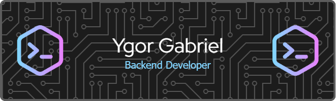

Tenho 24 anos e atualmente estou finalizando o curso técnico em Desenvolvimento de Sistemas na ETEC de São Paulo. Ao longo do curso, venho aprendendo linguagens como **Java**, **C#**, **PHP** e **SQL**, e desenvolvendo projetos práticos que reforçam meu interesse pela área de tecnologia.

Neste momento, estou trabalhando no meu **TCC**, que consiste em uma rede para **compartilhar experiências literárias** — um projeto que une programação e criatividade.

Sou apaixonado por tecnologia e, após a conclusão do curso técnico, pretendo ingressar em uma **faculdade de Tecnologia da Informação** para continuar evoluindo na área.

### Tecnologias que utilizo

  

### Entre em contato

    
  

